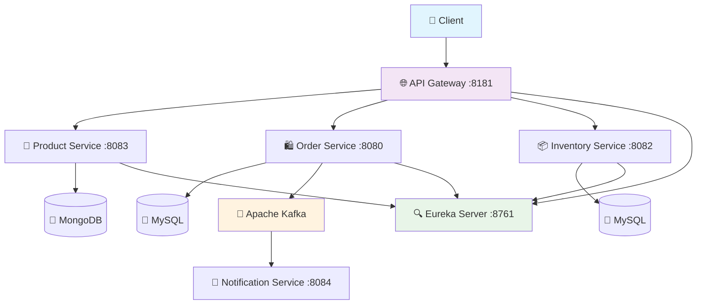

# 🛒 E-Commerce Microservices Platform

<div align="center">


**A production-ready e-commerce platform built with distributed, event-driven microservices architecture**

[🚀 Quick Start](#-quick-start) • [📖 Documentation](#-documentation) • [🏗️ Architecture](#️-architecture) • [🤝 Contributing](#-contributing)

</div>

---

## ✨ Features

- 🏪 **Product Catalog Management** - Complete CRUD operations for products
- 📦 **Inventory Tracking** - Real-time stock management and validation
- 🛍️ **Order Processing** - End-to-end order lifecycle management
- 🔄 **Event-Driven Architecture** - Asynchronous communication with Apache Kafka
- 🌐 **API Gateway** - Centralized routing and load balancing
- 🔍 **Service Discovery** - Dynamic service registration with Eureka
- 🚀 **Cloud-Ready** - Docker containerized with Kubernetes support

## 🚀 Quick Start

### Prerequisites

Ensure you have the following installed:

```bash
Java 17+          # Check: java --version
Maven 3.6+        # Check: mvn --version  
Docker & Compose  # Check: docker --version && docker-compose --version
```

### 1️⃣ Clone & Setup

```bash
git clone https://github.com/YOUR_USERNAME/ecommerce-microservices-platform.git
cd ecommerce-microservices-platform
```

### 2️⃣ Start Infrastructure

```bash
# Start databases and message broker
docker-compose up -d mysql mongodb kafka zookeeper
```

### 3️⃣ Launch Services

```bash
# Option A: Using Maven (Development)
./start-services.sh

# Option B: Using Docker (Production-like)
docker-compose up --build
```

### 4️⃣ Verify Setup

| Service | URL | Status |
|---------|-----|--------|
| 🌐 API Gateway | http://localhost:8181 | Entry point |
| 🔍 Eureka Dashboard | http://localhost:8761 | Service registry |
| 🛍️ Order Service | http://localhost:8181/api/order | Place orders |
| 🏪 Product Service | http://localhost:8181/api/product | Browse products |
| 📦 Inventory Service | http://localhost:8181/api/inventory | Check stock |

### 5️⃣ Test the System

```bash
# Get all products
curl http://localhost:8181/api/product

# Check inventory
curl "http://localhost:8181/api/inventory?skuCode=iphone-13"

# Place an order
curl -X POST http://localhost:8181/api/order \
  -H "Content-Type: application/json" \
  -d '{
    "orderLineItems": [
      {
        "skuCode": "iphone-13",
        "price": 1200,
        "quantity": 1
      }
    ]
  }'
```

## 🏗️ Architecture

<div align="center">



</div>

### 🔧 Technology Stack

| Component | Technology | Purpose |
|-----------|------------|---------|
| **🏗️ Framework** | Spring Boot 3.x | Microservices foundation |
| **☁️ Cloud** | Spring Cloud | Distributed system patterns |
| **🌐 Gateway** | Spring Cloud Gateway | API routing & load balancing |
| **🔍 Discovery** | Netflix Eureka | Service registration |
| **📨 Messaging** | Apache Kafka | Event-driven communication |
| **💾 Databases** | MySQL + MongoDB | Polyglot persistence |
| **🐳 Containers** | Docker + Compose | Containerization |
| **☸️ Orchestration** | Kubernetes | Production deployment |

### 📊 Service Overview

| Service | Port | Database | Status | Key Features |
|---------|------|----------|--------|--------------|
| 🌐 **API Gateway** | 8181 | - | ✅ | Request routing, Load balancing |
| 🏪 **Product Service** | 8083 | MongoDB | ✅ | Product CRUD, Search |
| 📦 **Inventory Service** | 8082 | MySQL | ✅ | Stock management, Validation |
| 🛍️ **Order Service** | 8080 | MySQL | ✅ | Order processing, Events |
| 🔍 **Discovery Server** | 8761 | - | ✅ | Service registry |
| 📧 **Notification Service** | 8084 | - | 🔄 | Email/SMS notifications |

## 📖 Documentation

| Document | Description |
|----------|-------------|
| 📋 **[Architecture Design](docs/ARCHITECTURE.md)** | Complete HLD/LLD documentation |
| 🔌 **[API Reference](docs/API.md)** | Detailed API specifications |
| 🚀 **[Deployment Guide](docs/DEPLOYMENT.md)** | Docker & Kubernetes setup |
| 🧪 **[Testing Strategy](docs/TESTING.md)** | Testing approaches & examples |
| 🤝 **[Contributing Guide](docs/CONTRIBUTING.md)** | Development guidelines |

## 🛠️ Development

### Project Structure

```
📁 ecommerce-microservices-platform/
├── 📁 services/
│   ├── 🏪 product-service/
│   ├── 📦 inventory-service/
│   ├── 🛍️ order-service/
│   └── 📧 notification-service/
├── 📁 infrastructure/
│   ├── 🌐 api-gateway/
│   ├── 🔍 discovery-server/
│   └── ⚙️ config-server/
├── 📁 kubernetes/
├── 🐳 docker-compose.yml
└── 📋 README.md
```

### Running Tests

```bash
# Run all unit tests
mvn clean test

# Run integration tests with Testcontainers
mvn clean verify -P integration-tests

# Run specific service tests
cd services/order-service && mvn test
```

### Development Commands

```bash
# Build all services
mvn clean package -DskipTests

# Start with live reload (development)
mvn spring-boot:run -Dspring-boot.run.profiles=dev

# View logs
docker-compose logs -f order-service

# Scale services
docker-compose up --scale order-service=3
```

## 🚀 Deployment

### 🐳 Docker Compose (Development)

```bash
# Start all services
docker-compose up -d

# Build and start
docker-compose up --build

# Stop all services
docker-compose down -v
```

### ☸️ Kubernetes (Production)

```bash
# Deploy to Kubernetes
kubectl apply -f kubernetes/

# Check status
kubectl get pods,svc

# View logs
kubectl logs -f deployment/order-service
```

## 🎯 Roadmap

### ✅ Current Features (v1.0)
- Product catalog management
- Inventory tracking with validation
- Order placement and processing
- Event-driven notifications
- Service discovery and routing
- API Gateway with load balancing

### 🔄 In Progress
- [ ] User authentication (Keycloak integration)
- [ ] React frontend application
- [ ] Distributed tracing (Zipkin)
- [ ] Circuit breakers (Resilience4j)

### 📅 Planned Features
- [ ] Payment processing integration
- [ ] Advanced search and filtering
- [ ] Recommendation engine
- [ ] Mobile app support
- [ ] Performance monitoring dashboard
- [ ] Multi-tenant architecture

## 🧪 API Examples

<details>
<summary>📋 Click to see API examples</summary>

### Create Product
```bash
curl -X POST http://localhost:8181/api/product \
  -H "Content-Type: application/json" \
  -d '{
    "name": "iPhone 13",
    "description": "Latest iPhone with A15 chip",
    "price": 999.99,
    "skuCode": "iphone-13"
  }'
```

### Place Order
```bash
curl -X POST http://localhost:8181/api/order \
  -H "Content-Type: application/json" \
  -d '{
    "orderLineItems": [
      {
        "skuCode": "iphone-13",
        "price": 999.99,
        "quantity": 2
      }
    ]
  }'
```

### Check Inventory
```bash
curl "http://localhost:8181/api/inventory?skuCode=iphone-13&skuCode=samsung-s21"
```

</details>

## 🔧 Troubleshooting

<details>
<summary>🆘 Common issues and solutions</summary>

### Port Already in Use
```bash
# Find process using port
lsof -i :8080
# Kill process
kill -9 <PID>
```

### Service Not Registered
```bash
# Check Eureka dashboard
open http://localhost:8761
# Restart discovery server
docker-compose restart eureka-server
```

### Database Connection Failed
```bash
# Check database status
docker-compose ps
# Reset databases
docker-compose down -v && docker-compose up -d mysql mongodb
```

</details>

## 🤝 Contributing

We welcome contributions! Here's how you can help:

1. 🍴 **Fork** the repository
2. 🌟 **Create** a feature branch (`git checkout -b feature/amazing-feature`)
3. ✅ **Commit** your changes (`git commit -m 'Add amazing feature'`)
4. 📤 **Push** to the branch (`git push origin feature/amazing-feature`)
5. 🔄 **Open** a Pull Request

### Development Guidelines

- ✅ Write tests for new features
- 📝 Update documentation
- 🎯 Follow Spring Boot best practices
- 🔍 Ensure all services register with Eureka
- 📨 Use events for cross-service communication

## 📜 License

This project is licensed under the **MIT License** - see the [LICENSE](LICENSE) file for details.

## 🙏 Acknowledgments

- Spring Boot team for the excellent framework
- Netflix for Eureka and other cloud patterns
- Apache Kafka for robust messaging
- Docker for containerization

## 📞 Support

- 📖 **Documentation**: Check the [docs](docs/) folder
- 🐛 **Bug Reports**: [Open an issue](https://github.com/YOUR_USERNAME/ecommerce-microservices-platform/issues)
- 💬 **Questions**: [Start a discussion](https://github.com/YOUR_USERNAME/ecommerce-microservices-platform/discussions)
- ⭐ **Show Support**: Star this repository if you find it useful!

---

<div align="center">

**Built with ❤️ using Spring Boot & Microservices Architecture**

[⬆ Back to Top](#-e-commerce-microservices-platform)

</div>